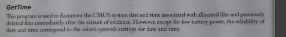

# David Jijo's GetTime


## Overview

This script is used to analyze and recover deleted files from an EXT4 partition using The Sleuth Kit (TSK) tools such as fls and istat. It efficiently filters out truly lost files while displaying valid deleted files along with their metadata. The idea comes from a tool in cybersecurity class that is now outdated, and not found anywhere, so its function is faithfully emulated by this script.



## Features

✅ Lists deleted files with their inode numbers.
✅ Displays deletion time and other metadata.
✅ Skips truly unrecoverable files (corrupted or overwritten).

✅ Shows the time info of any file in the system.
✅ Shows the time in the hardware as well as the system time.


## Installation

Ensure you have root access to run sudo commands for install.sh
In the directory of install.sh

```bash
./install.sh
```

## Usage

```
Usage: /usr/local/bin/getTime [option] [arguments]

Options:
  -systime             Display the current system time in the format YYYY-MM-DD HH:MM:SS.
  -cmosclock           Display the hardware clock time (requires sudo).
  -fileinfo <file>     Display file access, modification, and change times for the specified file.
  -deleted <num> <drive(optional)> Check the first <num> deleted files on drive(defaults to /dev/nvme0n1p5) and show their metadata if recoverable.
  -h, --help           Display this help text.
```

#### systime
```bash

getTime -systime

```

#### cmosclock
```bash

getTime -cmosclock

```

#### fileinfo 
```bash

getTime -fileinfo helloworld.py 

```

#### deleted

ok, so the default drive here is /dev/nvme0n1p5 which is most probably not the linux partition on ur device, to find out which partition is just run the command 

```bash
lsblk -f
```

and see which drive says **"ext4"** , use that drive as the argument in this command

```bash
-deleted 100 drive
```

## License

This script is open-source under the MIT License. Modify and use it at your own risk!

## Author

Developed by David Jijo, AlliedLens.